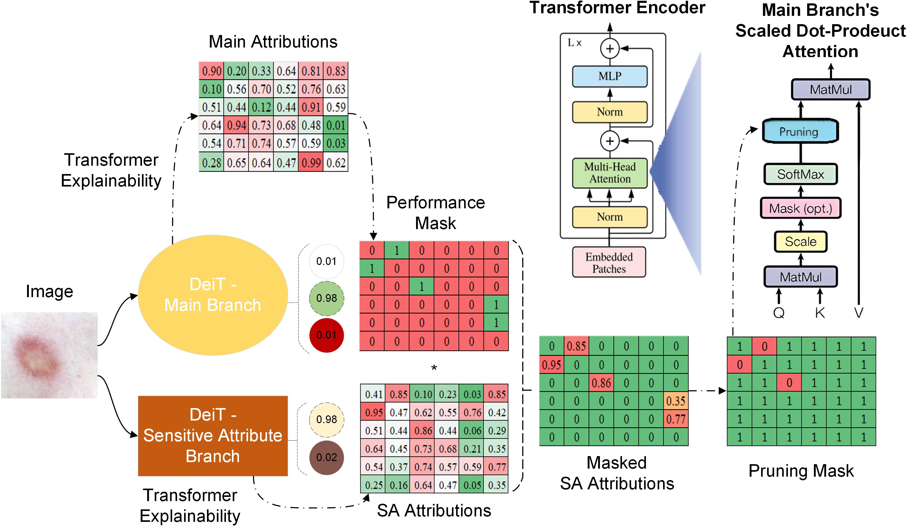

# XTranPrune: eXplainability-Aware Transformer Pruning for Bias Mitigation in Dermatological Disease Classification

This repository is the implementation of [**XTranPrune**](https://link.springer.com/chapter/10.1007/978-3-031-72117-5_70), our published debiasing method at [**MICCAI 2024**](https://conferences.miccai.org/2024/en/default.asp) conference.

## Method Overview


**Overview of XTranPrune:** It consists of two branches, the Main Branch and the SA Branch. We utilise an explainability method to find the nodes’ attribution in both branches. The calculated attributions allow us to generate the Performance Mask to keep the most important nodes, and then the Pruning Mask to prune the most discriminatory nodes in the Main Branch.

## Abstract
Numerous studies have demonstrated the effectiveness of deep learning models in medical image analysis. However, these models often exhibit performance disparities across different demographic cohorts, undermining their trustworthiness in clinical settings. While previous efforts have focused on bias mitigation techniques for traditional encoders, the increasing use of transformers in the medical domain calls for novel fairness enhancement methods. Additionally, the efficacy of explainability methods in improving model fairness remains unexplored. To address these gaps, we introduce XTranPrune, a bias mitigation method tailored for vision transformers. Leveraging state-of-the-art explainability techniques, XTranPrune generates a pruning mask to remove discriminatory modules while preserving performance-critical ones. Our experiments on two skin lesion datasets demonstrate the superior performance of XTranPrune across multiple fairness metrics.

**Keywords**: Bias mitigation | Explainable AI | Transformer pruning

## Citation

If you find this code useful for your research or work, please consider citing our paper:

[**XTranPrune: eXplainability-Aware Transformer Pruning for Bias Mitigation in Dermatological Disease Classification**](https://link.springer.com/chapter/10.1007/978-3-031-72117-5_70)
```sh
@inproceedings{ghadiri2024xtranprune,
  title={XTranPrune: eXplainability-Aware Transformer Pruning for Bias Mitigation in Dermatological Disease Classification},
  author={Ghadiri, Ali and Pagnucco, Maurice and Song, Yang},
  booktitle={International Conference on Medical Image Computing and Computer-Assisted Intervention},
  pages={749--758},
  year={2024},
  organization={Springer}
}
```

## Installation

1. Clone the repository:
    ```sh
    git clone https://github.com/AliGhadirii/XTranPrune.git
    cd XTranPrune
    ```

2. Create a conda environment:
    ```sh
    conda create --name XTranPrune_env python=3.12
    conda activate XTranPrune_env
    ```

3. Install PyTorch:
    ```sh
    conda install pytorch torchvision pytorch-cuda=12.1 -c pytorch -c nvidia
    ```
    For alternative installation commands that suit your device, please refer to the [PyTorch installation guide](https://pytorch.org/get-started/locally/).

4. Install the required packages:
    ```sh
    pip install -r Requirements.txt
    ```

## Datasets

To run experiments with this code, you will need to download the following skin lesion datasets:

1. **Fitzpatrick17k**  
   This dataset includes a collection of skin lesion images and metadata curated for research use.   
   - Repository: [https://github.com/mattgroh/fitzpatrick17k/tree/main](https://github.com/mattgroh/fitzpatrick17k/tree/main)

2. **PAD-UFES-20**  
   PAD-UFES-20 is a dataset comprising clinical images and patient data collected from smartphones, useful for skin lesion analysis tasks.  
   - Download from Mendeley Data: [https://data.mendeley.com/datasets/zr7vgbcyr2/1](https://data.mendeley.com/datasets/zr7vgbcyr2/1)

Before running any scripts, you need to generate the CSV files for the datasets. Run the `Dataset-Prepration.ipynb` notebook to preprocess the metadata and generate the required CSV files.

## Usage

### Configuration

Configuration files are located in the `Configs/` directory. You can modify the parameters in these YAML files to suit your needs. Here is an example from `configs_Fitz.yml`:
 
**Parameter Descriptions**
- `seed`: Random seed for reproducibility.
- `root_image_dir`: Directory containing the dataset images (set to the local path of the Fitzpatrick17k images).
- `Generated_csv_path`: Path to the preprocessed metadata CSV file generated by running `Dataset-Preparation.ipynb`.
- `dataset_name`: Name of the dataset to use. Options: `["Fitz17k", "HIBA", "PAD"]`.
- `output_folder_path`: Directory to save outputs such as logs and model checkpoints.
- `num_workers`: Number of workers for data loading, affecting data loading speed.
- `train`: Training-related parameters.
  - `branch`: Branch of the model to train. Options: `["main", "SA"]`.
  - `batch_size`: Batch size for training.
  - `main_level`: Primary classification level for model training. Options: `[high, mid, low]`.
  - `SA_level`: Secondary classification level for model training. Options: `[fitzpatrick_binary, fitzpatrick]`.
  - `n_epochs`: Number of epochs to train the model.
  - `pretrained`: Whether to use a pretrained model. Options: `[True, False]`.
- `eval`: Evaluation parameters.
  - `weight_path`: Path to the model weights for evaluation.
- `prune`: Parameters specific to the pruning process.
  - `main_br_path`: Path to main branch model weights for pruning.
  - `SA_br_path`: Path to sub-branch model weights for pruning.
  - `stratify_cols`: Columns to stratify samples by during pruning, typically including the primary and secondary classification levels (e.g., `["high", "fitzpatrick"]`).
  - `sampler_type`: Type of sampler to use for data selection. Options: `["WeightedRandom", "Stratified", "CustomStratified"]`.
  - `target_bias_metric`: Bias metric targeted during pruning. Options: e.g., `EOM`.
  - `max_consecutive_no_improvement`: Maximum consecutive iterations allowed without improvement before stopping.
  - `batch_size`: Batch size specifically for pruning.
  - `num_batch_per_iter`: Number of batches per pruning iteration.
  - `main_mask_retain_rate`: Retain rate for the main mask, which controls how much of the original model structure is kept.
  - `pruning_rate`: Rate of pruning applied at each iteration.
  - `cont_method`: Contrastive method used for model attention and attribution. Options: `["transformer_attribution", "attr", "grad", "attn", "TAM", "AttrRoll", "FTaylor", "FTaylorpow2"]`.
  - `MaskUpdate_Type`: How the mask updates during pruning. Options: `["AND", "LAST"]`.
  - `verbose`: Verbosity level of logging, where higher numbers give more detailed information. Options: `[0, 1, 2]`.


### Training

To train a base model, run the `Train_DeiT-S.py` script with the desired configuration file:

```sh
python Train_DeiT-S.py --config configs_Fitz.yml
```

### Debiasing
To prune a trained model, use the XTranPrune.py script:
```sh
python XTranPrune.py --config configs_Fitz.yml
```


### Evaluation
To evaluate a model using performance and fairness metrics, run the Evaluation.py script:
```sh
python Evaluation.py --config configs_Fitz.yml
```


## Contributing
Contributions are welcome! Please open an issue or submit a pull request for any changes.

## License
This project is licensed under the MIT License. See the [LICENSE](./LICENSE) file for details.